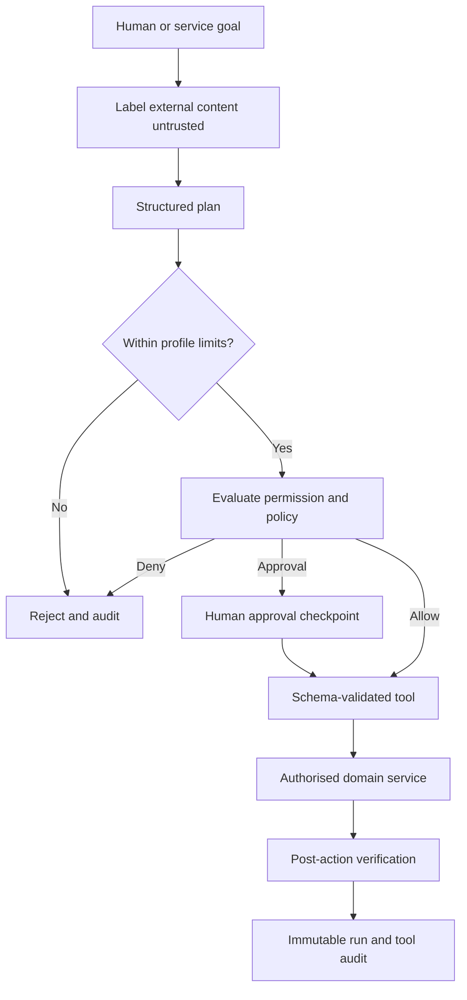

# Agent safety model

Agents are principals with explicit profiles, tool allowlists, permission scopes, time and step limits, tool-call limits, affected-resource limits, rate limits, dry-run defaults, and immutable run/tool records.

Certificate fields, tickets, connector responses, imported metadata, and discovered text remain data. They cannot redefine instructions or tools. Models never receive private keys or connector secrets. Mutating tools default to dry-run and return a human-readable impact summary. Sensitive and bulk actions require approval regardless of model confidence.
