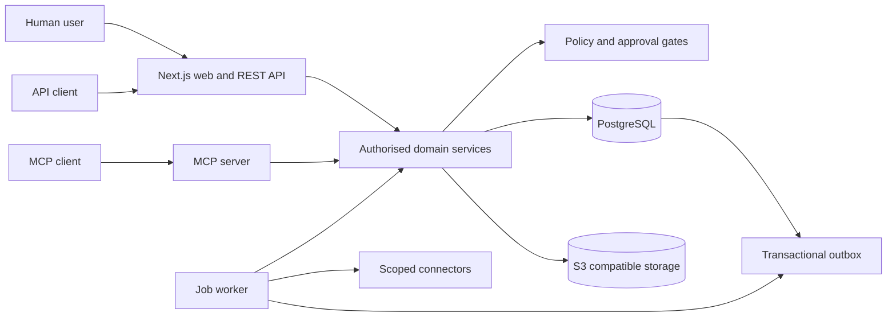
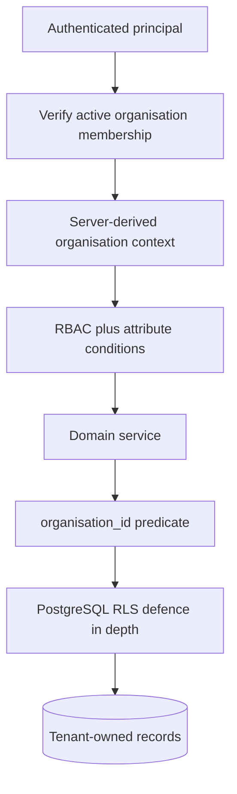

# Architecture and ADR-001

Status: accepted, 2026-07-11.

## Decision

BlakCert begins as a modular monolith with four independently scalable processes: Next.js web/API, PostgreSQL job worker, MCP server, and migration runner. All entry points call shared domain services. PostgreSQL is the system of record and provides tenant-scoped relational data, transactions, advisory locks, the durable queue, transactional outbox, and append-only audit chain.

This shape keeps certificate lifecycle invariants in one codebase while allowing high-volume scans, connector synchronisation, reports, and MCP traffic to scale independently. A queue provider and object storage provider remain explicit ports. No microservice split is warranted until measured workload or residency boundaries require it.

## Repository structure

```text
db/schema/                 Drizzle schema barrel and domain tables
db/migrations/             generated SQL plus security hardening SQL
db/seed/                   deterministic non-secret fixtures
src/app/                   Next.js 16 pages and route handlers
src/api/                   HTTP authentication, errors, cursors, OpenAPI
src/auth/                  Better Auth and organisation-aware sessions
src/certificates/          certificate parsing, risk, service, queries
src/organisations/         organisation creation and membership
src/permissions/           RBAC and attribute conditions
src/audit/                 immutable chained event writer
src/jobs/                  durable queue and worker
src/mcp/                   MCP contracts, resources, and granular tools
src/security/              redaction and boundary controls
src/encryption/            envelope encryption primitives
src/observability/         structured logs and telemetry hook
docs/                      operations and security documentation
```

## System architecture



## Multi-tenant boundary



Client-supplied organisation identifiers are never authoritative. Browser requests resolve an active-organisation cookie against membership. API keys are permanently bound to one organisation. MCP sessions inherit that binding.

Tenant-owned service queries execute inside a transaction that sets `blakcert.organisation_id` with `SET LOCAL`; RLS policies independently enforce that value. Production uses a non-owner web role without `BYPASSRLS`. The cross-tenant queue claimer uses a separate worker role with narrowly granted `BYPASSRLS`; claimed handlers then set tenant context before domain access.

## Trade-offs

- PostgreSQL jobs reduce operational dependencies and preserve transactional scheduling. If scan volume exceeds database queue targets, the queue port can move to a managed provider without changing domain handlers.
- PEM public certificates are stored relationally for validation and evidence. Private keys use a separate custody service and never share the certificate metadata API.
- Audit hash chains are serialised per organisation with advisory locks. Large tenants can move to signed time-partition batches while preserving verification semantics.
