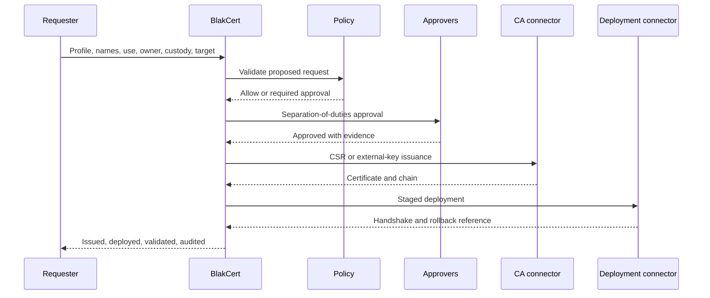
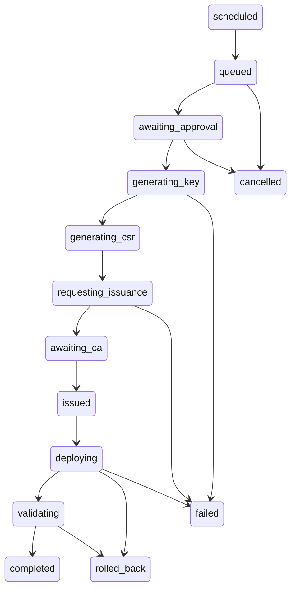

# Certificate lifecycle

## Issuance

## Renewal state machine

Every transition is idempotent, version-checked, advisory-locked per certificate, and correlated to job, approval, outbox, and audit records. Blue-green deployment validates the replacement before cutover and retains a rollback reference until post-deployment verification completes.

Revocation is always a request workflow. High-risk certificates require step-up and multiple approvers, requester/approver separation, CA confirmation, OCSP/CRL verification, deployment cleanup, replacement planning, evidence, and incident linkage.
