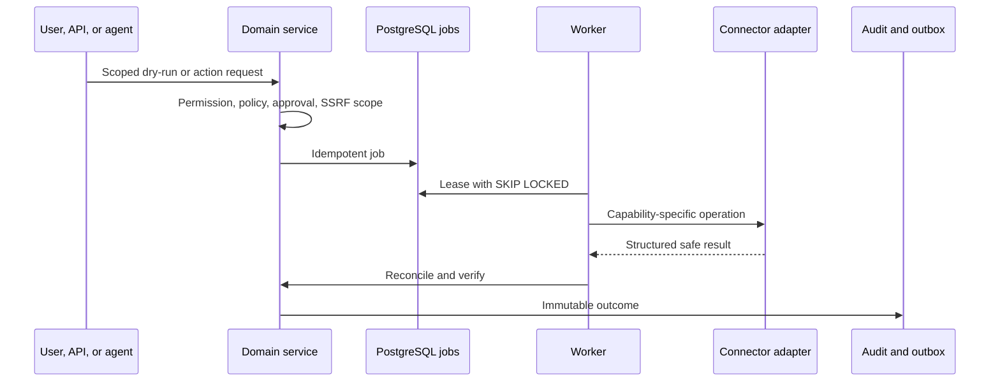

# Connector development

A connector declares type, semantic version, capabilities, configuration and secret schemas, authentication mode, allowed scopes, rate limit, retry policy, and webhook support. Implementations expose `testConnection`, `testPermissions`, `discover`, `sync`, `deploy`, `validate`, and credential-rotation operations only when declared.

Secrets are write-only, AES-256-GCM encrypted locally, and KMS-wrapped in production. Never return them from repositories, browsers, logs, audit, MCP, or agent context. HTTP connectors must use `validateOutboundTarget` before initial requests and every redirect, pin resolved addresses, and enforce time/size limits.

Credential-dependent adapters remain disabled until configured. Test mode must use sandbox endpoints and visibly label its results; it must never report a live operation as successful.
