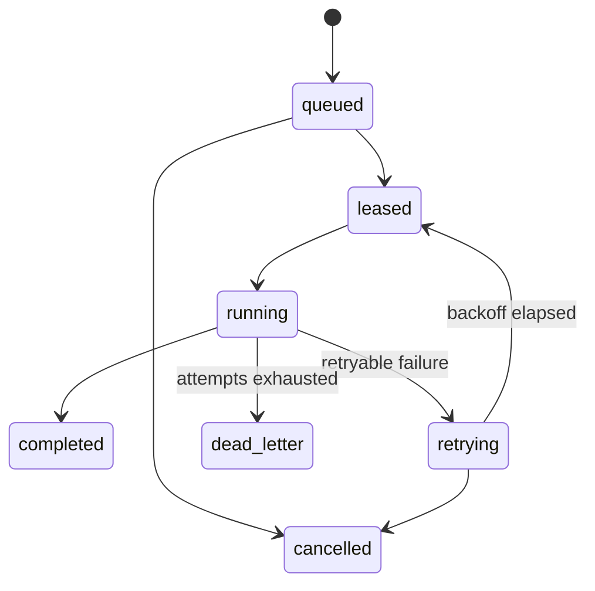

# Durable background jobs

Jobs live in PostgreSQL with queue, tenant, type, validated payload, idempotency key, priority, schedule, attempts, exponential backoff with jitter, lease owner/expiry, heartbeat, progress, cancellation, correlation, safe result, and dead-letter status.

Workers claim jobs with `FOR UPDATE SKIP LOCKED`, set a lease, and run idempotent handlers. Expired leases are reclaimable. Concurrency-sensitive lifecycle work additionally takes a resource advisory lock. Recurring schedulers only enqueue jobs; they do not perform domain work in the web process.

