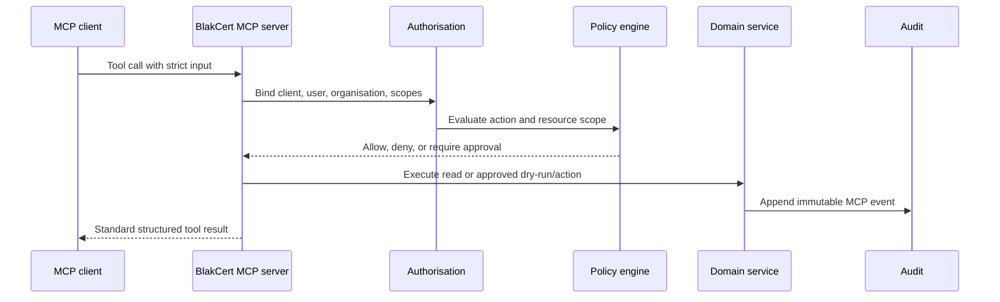

# MCP security and operations

BlakCert exposes granular MCP tools, never SQL, shell, arbitrary HTTP, secret retrieval, private-key export, permission changes, or approval bypass.



Every tool returns `success`, `operationId`, `correlationId`, `dryRun`, `status`, `summary`, `data`, `warnings`, `policyDecisions`, `approvalRequired`, and `auditEventId`. Outputs are checked for private-key markers before transmission. Certificate PEM is also omitted because MCP use cases need metadata, not public key blobs.

Run the local stdio server with a user-bound API key containing `mcp:connect`:

```bash
BLAKCERT_MCP_API_KEY=bk_... npm run mcp
```

Remote clients use the standards-compliant Streamable HTTP endpoint at `/api/mcp` with an organisation-bound bearer API key containing `mcp:connect`. The transport validates host and origin to defend against DNS rebinding. Production ingress should prefer OAuth 2.1 short-lived access tokens as that deployment profile is enabled.

Remote deployments place the MCP server behind OAuth 2.1 with short-lived tokens and audience, tenant, and tool scopes. Token revocation and every call are correlated to audit events.
