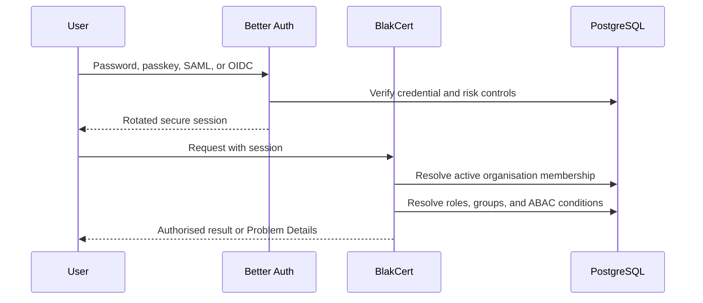
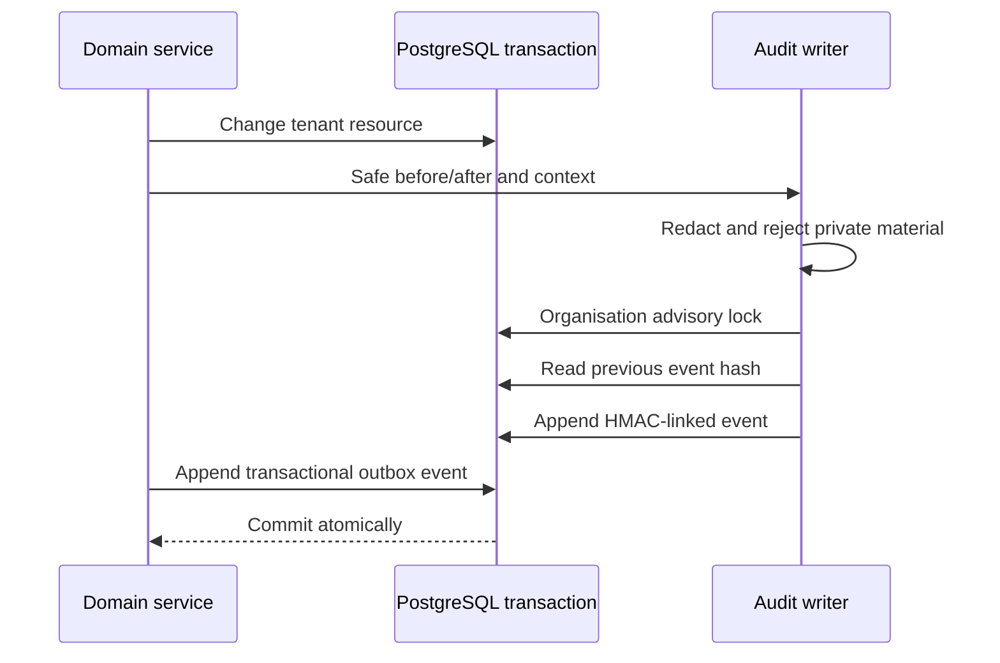

# Security architecture

BlakCert follows least privilege, OWASP ASVS controls, strict tenant scoping, and explicit high-risk workflows.

## Authentication flow

Passwords are handled by Better Auth. TOTP, recovery codes, WebAuthn challenges, sessions, and provider tokens use audited implementations. Production requires email verification and secure cookies. Sensitive actions require a short-lived step-up assertion and approval where policy demands it.

## Private-key controls

Private key material is rejected by certificate import and MCP output guards. It is forbidden in prompts, logs, audit metadata, connector results, and ordinary object storage. Connector secrets use AES-256-GCM with authenticated context. Production replaces the local wrapping key with KMS/HSM envelope encryption and records key version metadata. Export is disabled by default and has no MCP tool.

## SSRF and discovery

Active discovery is only scheduled against approved discovery scopes. The connector HTTP port must resolve every hostname, reject metadata/link-local destinations, compare all resolved addresses to explicit CIDR policy, restrict protocols and ports, revalidate redirects, pin the chosen IP for a request, cap time and response bytes, and audit the scope and correlation ID. Private ranges require an approved internal scope. Arbitrary URL tools do not exist.

## Audit flow

Database grants deny UPDATE and DELETE on `audit_events` to the application role. Events include actor, action, resource, request and correlation IDs, safe state hashes, source context, outcome, and chain hashes.

## Security headers and failures

The application sets anti-sniffing, frame, referrer, permissions, and opener policies. Deployment ingress adds HSTS and a nonce-based CSP after the final domain and telemetry destinations are known. API errors use RFC 9457 without stack traces. Structured logs redact credential-shaped fields.
